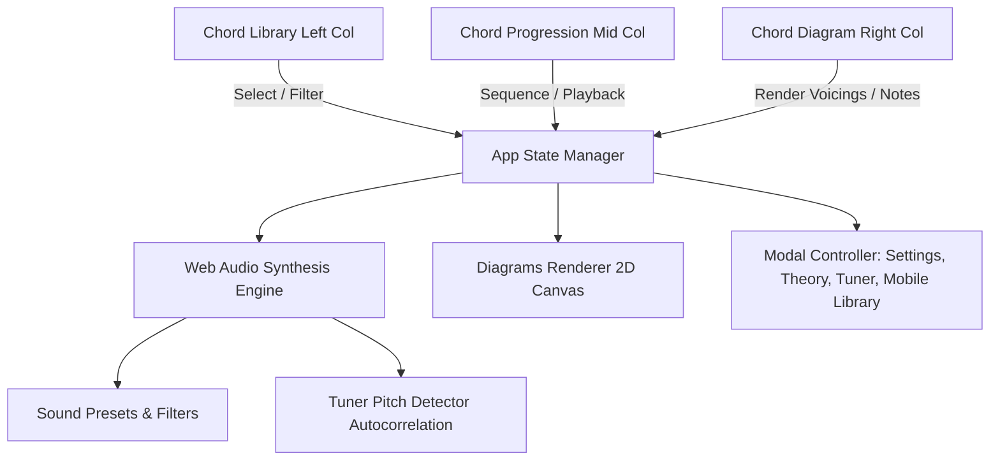

# Implementation Plan: ChordFlow Full Feature Suite & Changes

Implementation plan for all feature updates and changes outlined in [`docs/changes.md`](file:///Users/peace/Work/2026/ChordFlow/docs/changes.md), expanding ChordFlow with new instruments (**Violin**, **Bass**, **Guitalele**), real-time **Tuner**, modal system for settings/theory/tuner, customizable audio synthesis presets, auto-scrolling piano keyboard, chord voicings selector, capo transposition awareness, and responsive 3-column / modal layout.

---

## User Review Required

> [!IMPORTANT]
> - **Zero External Build Disruptions**: All enhancements will compile strictly with `npm run build` (`tsc`) and run in zero-bundle browser ES modules with no heavy runtime dependencies.
> - **Modal Refactor for Settings & Theory**: The in-page Instrument & Settings card and Music Theory cards in the middle column will be cleanly transitioned into lightweight glassmorphism modals triggered by header icons (⚙️ Settings, 🎼 Music Theory, 🎯 Tuner), keeping the main 3-column view compact and fitting in a single viewport.
> - **Non-Destructive Data Expansion**: `data/instruments.json` and `data/chords.json` will be updated to include rich voicings, violin fingerings/double stops, bass chord tones, guitalele shapes, and sound engine configurations while maintaining 100% backward compatibility.

---

## Proposed Changes



---

### Phase 1: Data Models & JSON Datasets Expansion
Files to modify:
- [`ts/types.ts`](file:///Users/peace/Work/2026/ChordFlow/ts/types.ts)
- [`data/instruments.json`](file:///Users/peace/Work/2026/ChordFlow/data/instruments.json)
- [`data/chords.json`](file:///Users/peace/Work/2026/ChordFlow/data/chords.json)

1. **`ts/types.ts`**:
   - Add `"violin" | "bass" | "guitalele"` to `InstrumentId`.
   - Add `VoicingOption` interface (`id`, `label`, `guitar?: number[]`, `piano?: number[]`, `ukulele?: number[]`, `violin?: number[]`, `bass?: number[]`, `guitalele?: number[]`).
   - Add `ChordVoicings` to `Chord` interface.
   - Add `SoundPresetConfig` and `AudioSettings` (`lpf`, `hpf`, `decay`, `detune`, `reverb`, `volume`).
   - Add `displayView: "chord" | "notes"` to `AppState`.
   - Update `progression` max length limit (8 in clean mode, 16 in advanced mode).
   - Add `title: string` to `Progression` state.
2. **`data/instruments.json`**:
   - Add **Violin** (tuning GD AE, D-tuning GDAD).
   - Add **Bass Guitar** (tuning EADG, Drop D DADG, F tuning FADF).
   - Add **Guitalele** (tuning ADGCEA, 6-string).
3. **`data/chords.json`**:
   - Populate `voicings` array for chords (Open, Barre, Inversions, Spread, 3rd fret, 5th fret).
   - Add `violin` (first-position double-stop fingerings & notes) and `bass` (root, 5th, octave frets/notes) to instrument voicings.

---

### Phase 2: Web Audio Synthesis & Sound Presets
Files to modify:
- [`ts/audio.ts`](file:///Users/peace/Work/2026/ChordFlow/ts/audio.ts)

1. **Audio Synthesis Models for New Instruments**:
   - `synthesizeViolin`: Sine wave with smooth bowed attack, rich harmonics, and LFO vibrato (6 Hz, 15 cents depth).
   - `synthesizeBass`: Dual oscillator (sine sub-bass + low-pass filtered sawtooth) with deep bass envelope and punchy transient.
   - `synthesizeGuitalele`: Bright 6-string acoustic pluck shifted up by 5 semitones.
2. **Sound Presets Support**:
   - Piano: Grand Piano, Electric Piano, Organ, Lofi Piano, Music Box.
   - Guitar: Acoustic (Steel), Acoustic (Nylon), Electric Clean, Electric Distort, Jazz Archtop.
   - Ukulele: Standard, Tenor, Baritone.
   - Violin: Standard, Violin (Dampened).
   - Bass: Acoustic/Upright, Electric Clean, Electric Finger, Slap.
   - Harmonica: Standard, Draw Bar, Octave.
3. **Custom Audio Filter Effects Chain**:
   - Master Gain with persistent volume control slider.
   - Low-Pass BiquadFilterNode (`200 Hz – 20 kHz`).
   - High-Pass BiquadFilterNode (`20 Hz – 2 kHz`).
   - Algorithmic Reverb / Convolver with wet/dry mix.
   - LocalStorage persistence for user sound settings.
4. **Harmonica Sequential Progression Playback**:
   - Plays chord notes sequentially (arpeggio style with natural breath delay) instead of block polyphony.

---

### Phase 3: Canvas Diagram Rendering & Auto-Scroll Piano
Files to modify:
- [`ts/diagrams.ts`](file:///Users/peace/Work/2026/ChordFlow/ts/diagrams.ts)

1. **Auto-Scrolling Piano Keyboard**:
   - Dynamic viewport calculation: computes min/max MIDI note in active chord/voicing and auto-pans viewport so chord notes are centered.
   - Interactive manual pan support (drag/swipe or navigation arrows `←` `→`).
2. **Voicings & Alternative Fingerings**:
   - Renders selected chord voicing variant across all string instruments and keyboard.
3. **New Instrument Diagrams**:
   - **Violin**: 4 strings (`G, D, A, E`), fingerboard markers (1st position, open strings, double stop pairs).
   - **Bass**: 4 heavy strings (`E, A, D, G`), fret markers `0–12`, root note highlighted in accent color, 5th/octave highlighted in secondary color.
   - **Guitalele**: 6 strings (`A, D, G, C, E, A`), frets `0–8`.
4. **View Toggle (`Chord` vs `Notes`)**:
   - Support rendering full chord shape or individual scale degree notes across the fretboard/keyboard.
   - Defaults to "Notes" for Harmonica, Violin, Bass; "Chord" for Guitar, Piano, Ukulele, Guitalele.
5. **Capo-Aware Diagrams**:
   - String diagram displays fret 0 at capo position with clear "Capo: X" badge.

---

### Phase 4: Pitch Detector & Real-time Tuner Modal
Files to create/modify:
- [NEW] [`ts/tuner.ts`](file:///Users/peace/Work/2026/ChordFlow/ts/tuner.ts)
- [`index.html`](file:///Users/peace/Work/2026/ChordFlow/index.html)
- [`css/main.css`](file:///Users/peace/Work/2026/ChordFlow/css/main.css)

1. **Tuner Engine (`ts/tuner.ts`)**:
   - Web Audio `getUserMedia({ audio: true })` + `AnalyserNode`.
   - Autocorrelation / YIN pitch detection algorithm.
   - Detects frequency, nearest note, and cent deviation ($-50$ to $+50$ cents).
   - Preset string tunings for **Guitar** (`E2, A2, D3, G3, B3, E4`), **Ukulele** (`G4, C4, E4, A4`), **Guitalele** (`A2, D3, G3, C4, E4, A4`), **Violin** (`G3, D4, A4, E5`), and **Bass** (`E1, A1, D2, G2`).
2. **Visual Tuner Modal**:
   - Animated needle gauge dial (`-50` flat $\to$ `0` in-tune $\to$ `+50` sharp).
   - Dynamic color: Red (far) $\to$ Yellow (close) $\to$ Green (in tune).
   - Auto-advance to next string on holding in tune for 2 seconds.

---

### Phase 5: Chord Library, Progression Card, and Keyboard Shortcuts Upgrades
Files to modify:
- [`ts/chord.ts`](file:///Users/peace/Work/2026/ChordFlow/ts/chord.ts)
- [`ts/progression.ts`](file:///Users/peace/Work/2026/ChordFlow/ts/progression.ts)
- [`ts/ui.ts`](file:///Users/peace/Work/2026/ChordFlow/ts/ui.ts)
- [`ts/export.ts`](file:///Users/peace/Work/2026/ChordFlow/ts/export.ts)

1. **Chord Library**:
   - Root filter buttons ordered strictly: `C, D, E, F, G, A, B, C#, D#, E#, F#, G#, A#, B#`.
   - Bigger buttons with increased padding/touch targets.
   - Desktop & Tablet fixed height: exactly 3 rows with internal custom scrollbar.
2. **Chord Progression Card**:
   - Dynamic limits: max 8 chords in Clean Mode, max 16 in Advanced Mode.
   - Counter indicator: `5 / 8` or `12 / 16`.
   - Editable custom title input (default `"My Progression"`, auto-fills from loaded presets, included in JSON/PNG/PDF exports).
   - Progression toolbar: 💾 Save dropdown (JSON, PDF, PNG) + 📂 Import JSON file picker + 📋 Copy progression as text (e.g. `"C G Am F"`) with toast.
   - Transport buttons: enlarged $\ge 44\times 44\text{px}$ pill buttons with distinct icons (⏹ Stop, 🔁 Repeat, 🎵 Tap Tempo).
   - Volume slider ($0–100\%$) with speaker icon and localStorage persistence.
   - Strum Pattern: Read-only visual in Clean mode; full interactive Strum Pattern Editor grid in Advanced Mode.
   - Transposition display when Capo > 0 (e.g. `G (Capo 2) → A`).
3. **Keyboard Shortcuts**:
   - Keys `1`–`8` (and `9`–`0` in Advanced Mode):
     - `1`–`8`: Down strum / simultaneous piano notes.
     - `Shift + 1`–`8`: Up strum.
     - Hold `Shift + 1`–`8`: Down-Up strum / arpeggiated piano.
   - Preserved `Space` / `Enter` (play active) and `←`/`→` (step active chord).

---

### Phase 6: Responsive Layout & Glassmorphism Modal System
Files to modify:
- [`index.html`](file:///Users/peace/Work/2026/ChordFlow/index.html)
- [`css/main.css`](file:///Users/peace/Work/2026/ChordFlow/css/main.css)
- [`ts/ui.ts`](file:///Users/peace/Work/2026/ChordFlow/ts/ui.ts)

1. **Modal System**:
   - ⚙️ **Instrument & Settings Modal**: Capo, Tuning, Strum Pattern, Sound Presets, LPF/HPF/Decay/Detune/Reverb sliders.
   - 🎼 **Music Theory Modal**: Circle of Fifths SVG, Scale Degrees, Intervals, Inversions toggles.
   - 🎯 **Tuner Modal**: Pitch detection & string meter.
   - 📱 **Mobile Chord Library Modal**: On mobile portrait (<480px), middle and right columns take full width; Chord Library opens as a bottom sheet / modal via "+ Add / Change Chord".
2. **Responsive CSS**:
   - Desktop ($\ge 768\text{px}$) & Tablet landscape ($\ge 480\text{px}$): 3-column layout fitting seamlessly in viewport.
   - Mobile portrait ($<480\text{px}$): 2-column layout (Progression + Diagram).

---

## Verification Plan

### Automated Tests
Run comprehensive test suite verifying all new datasets, instruments, sound presets, voicings, chord limits, and transposition algorithms:
```bash
npm run build
node scratch/test_app.js
```

### Acceptance Criteria Checklist (Section 11 Verification)
- [ ] Root filter buttons are bigger and in correct order (`C, D, E, F, G, A, B, C#, D#, E#, F#, G#, A#, B#`)
- [ ] Chord list is 3 rows tall on desktop/tablet with internal scroll
- [ ] Beginner mode allows 8 chords; Advanced allows 16
- [ ] Progression title is editable and included in exports
- [ ] Save/Import buttons are inside the Progression card (not footer)
- [ ] Stop/Repeat/Tap buttons are larger with clear styling
- [ ] Volume slider works and persists
- [ ] Copy button copies chord names as space-separated text
- [ ] Strum pattern is visible in Beginner mode; editable in Advanced
- [ ] Keys 1–8 play chords; Shift+1–8 plays up strum; Hold Shift+1–8 plays D+U
- [ ] Sound presets available in Advanced mode (Piano, Guitar, etc.)
- [ ] Low/high pass, decay, detune, reverb sliders work
- [ ] Piano diagram auto-scrolls to center the chord
- [ ] Voicing dropdown shows alternative fingerings and re-renders
- [ ] Tablet landscape uses 3-column layout (same as desktop)
- [ ] Mobile portrait shows 2 columns; library opens as modal via "Add Chord" button
- [ ] Instrument & Settings and Music Theory are modals (icon-triggered)
- [ ] Capo transposes chord names in progression and adjusts diagrams
- [ ] Violin, Bass, and Guitalele are playable with correct diagrams & sound
- [ ] Harmonica shows single notes (holes) by default, not full chords
- [ ] Violin/Bass default to "Notes" view; Guitar/Piano/Ukulele default to "Chord" view
- [ ] View Toggle (Chord/Notes) works for all instruments
- [ ] Tuner modal works with mic for all 5 instruments
- [ ] No console errors; all TS compiles clean in strict mode
- [ ] Works at 375px width without overflow
